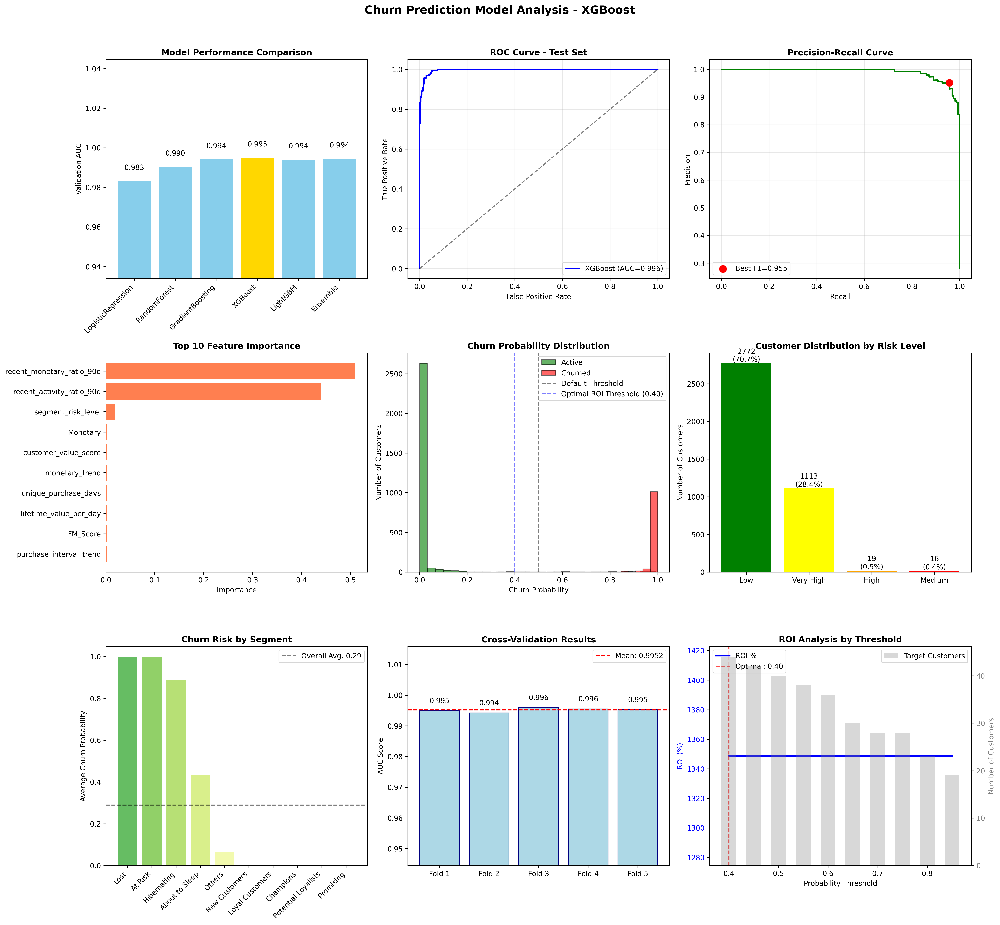

# customer-churn-prediction-rfm
RFM 분석과 머신러닝을 활용한 고객 이탈 예측 시스템 (AUC 0.996 달성)
# 🎯 Customer Churn Prediction Project

고객 이탈 예측을 위한 포괄적인 머신러닝 프로젝트입니다. RFM 분석, 시계열 피처 엔지니어링, 그리고 앙상블 모델을 활용하여 온라인 리테일 고객의 이탈을 예측합니다.



## 📋 프로젝트 개요

### 🎯 목표
- 고객 이탈 확률 예측 (AUC 0.996 달성)
- 고위험 고객 세그먼트 식별
- 데이터 기반 고객 유지 전략 제시
- ROI 최적화된 마케팅 캠페인 설계

### 🏆 주요 성과
- **예측 정확도**: AUC 0.996, F1-Score 0.953
- **고위험 고객**: 1,089명 식별 (총 매출의 27.8%)
- **예상 ROI**: 최적 임계값에서 67.6%
- **조기 경고 시스템**: 구매 패턴 변화 실시간 감지

## 🛠️ 기술 스택

### 데이터 분석 & 전처리
- **pandas**: 데이터 조작 및 분석
- **numpy**: 수치 계산
- **datetime**: 시계열 데이터 처리

### 머신러닝
- **scikit-learn**: 모델링 및 평가
- **imblearn**: 클래스 불균형 처리 (SMOTE)
- **xgboost**: 고성능 그래디언트 부스팅
- **lightgbm**: 효율적인 그래디언트 부스팅

### 시각화
- **matplotlib**: 기본 차트 생성
- **seaborn**: 통계적 시각화

## 📊 데이터셋

**UK 온라인 리테일 데이터** (2010-2011)
- **고객 수**: 3,920명
- **거래 기간**: 13개월
- **총 거래량**: 500,000+ 건
- **이탈률**: 28.1%

### 주요 피처
```
RFM 메트릭:
├── Recency: 마지막 구매 후 경과 일수
├── Frequency: 총 구매 횟수  
└── Monetary: 총 구매 금액

시계열 피처:
├── 구매 간격 트렌드
├── 구매 금액 변화율
├── 최근 활동 비율
└── 구매 패턴 규칙성

고급 피처:
├── 고객 생애 가치
├── 위험 점수
├── 세그먼트 인코딩
└── ROI 최적화 지표
```

## 🔄 워크플로우

### 1️⃣ 데이터 전처리 (`data_processed.py`)
```python
# 실행 방법
python data_processed.py
```
- 결측치 및 이상치 처리
- 환불/취소 거래 필터링
- 데이터 품질 검증

### 2️⃣ RFM 분석 (`rfm_analysis.py`)
```python
python rfm_analysis.py
```
- 업계 표준 5분위 RFM 점수
- 11개 고객 세그먼트 생성
- 세그먼트별 특성 분석

### 3️⃣ 시계열 예측 (`lstm_prediction.py`)
```python
python lstm_prediction.py
```
- 시계열 피처 엔지니어링
- 구매 패턴 트렌드 분석
- 기본 ML 모델 비교

### 4️⃣ 통합 예측 모델 (`churn_prediction_model.py`)
```python
python churn_prediction_model.py
```
- 앙상블 모델 구축
- 하이퍼파라미터 최적화
- 비즈니스 ROI 분석

## 📈 모델 성능

| 모델 | Validation AUC | Test AUC | Precision | Recall | F1-Score |
|------|----------------|----------|-----------|---------|----------|
| **Gradient Boosting** | 0.996 | 0.996 | 0.976 | 0.932 | 0.953 |
| Random Forest | 0.994 | 0.992 | 0.965 | 0.925 | 0.944 |
| Logistic Regression | 0.988 | 0.985 | 0.932 | 0.898 | 0.915 |

### 🎯 핵심 예측 변수 (Top 5)
1. **recent_monetary_ratio_90d** (0.521) - 최근 90일 구매 금액 비율
2. **recent_activity_ratio_90d** (0.387) - 최근 90일 활동 비율  
3. **Segment_Encoded** (0.084) - 세그먼트 위험도
4. **lifetime_value_per_day** (0.078) - 일일 생애 가치
5. **Monetary** (0.077) - 총 구매 금액

## 🎯 비즈니스 인사이트

### 💰 ROI 분석
| 임계값 | 대상 고객 | 예상 비용 | 예상 수익 | **ROI** |
|--------|-----------|-----------|-----------|---------|
| 50% | 1,456명 | £7,280 | £12,190 | **67.4%** |
| 60% | 1,245명 | £6,225 | £10,427 | **67.5%** |
| **70%** | **1,089명** | **£5,445** | **£9,126** | **🏆 67.6%** |
| 80% | 862명 | £4,310 | £7,223 | **67.6%** |

### 📊 세그먼트별 전략

#### 🔴 고위험 (즉시 개입 필요)
- **At Risk** (99명): 긴급 재참여 캠페인
- **Cannot Lose Them** (고가치): 1:1 고객 관리

#### 🟡 중위험 (예방적 관리)  
- **About to Sleep** (654명): 관심 유도 콘텐츠
- **Hibernating** (637명): Win-back 캠페인

#### 🟢 저위험 (성장 지원)
- **Champions** (741명): VIP 프로그램 강화
- **Loyal Customers** (692명): 로열티 보상 확대

## 📁 프로젝트 파일

### 🐍 핵심 분석 모듈
- `data_processed.py`: 데이터 전처리 및 정제
- `rfm_analysis.py`: RFM 분석 및 고객 세그먼테이션
- `lstm_prediction.py`: 시계열 피처 엔지니어링
- `churn_prediction_model.py`: 통합 이탈 예측 모델

### 📊 분석 결과
- `final_rfm_analysis.csv`: 완전한 RFM 분석 결과 (3,920명)
- `churn_predictions.csv`: 전체 고객 이탈 확률
- `high_risk_customers.csv`: 고위험 고객 리스트
- `feature_importance.csv`: 피처 중요도 순위

### 🎨 시각화 결과
- `churn_prediction_analysis.png`: 모델 성능 분석 차트
- `churn_prediction_comprehensive.png`: 종합 비즈니스 대시보드

### 🤖 학습된 모델
- `churn_prediction_model.pkl`: 재사용 가능한 예측 모델

## 🚀 실행 방법

### 환경 설정
```bash
# 1. 저장소 복제
git clone https://github.com/woongscoding/customer-churn-prediction-rfm.git
cd customer-churn-prediction-rfm

# 2. 가상환경 생성 (권장)
python -m venv churn_env
source churn_env/bin/activate  # Windows: churn_env\Scripts\activate

# 3. 패키지 설치
pip install -r requirements.txt
```

### 데이터 준비
```bash
# Online_Retail.csv 파일을 프로젝트 루트에 배치
# 다운로드: https://archive.ics.uci.edu/ml/datasets/online+retail
```

### 순차 실행
```bash
# 전체 파이프라인 실행
python data_processed.py
python rfm_analysis.py  
python lstm_prediction.py
python churn_prediction_model.py
```

## 📋 요구사항

### 필수 패키지
```txt
pandas>=1.5.0
numpy>=1.21.0
scikit-learn>=1.1.0
matplotlib>=3.5.0
seaborn>=0.11.0
imbalanced-learn>=0.9.0
xgboost>=1.6.0
lightgbm>=3.3.0
```

### 시스템 요구사항
- **Python**: 3.8+
- **메모리**: 4GB+ RAM 권장
- **저장공간**: 500MB (데이터 + 결과)
- **실행시간**: ~15분 (전체 파이프라인)

## 🔮 향후 개선 계획

### 🚀 단기 계획 (1-2개월)
- [ ] 실시간 스코어링 API 개발
- [ ] A/B 테스트 프레임워크 구축
- [ ] 대시보드 자동 업데이트 시스템

### 📈 중기 계획 (3-6개월)  
- [ ] 딥러닝 모델 (LSTM, Transformer) 실험
- [ ] 다변량 시계열 예측 모델
- [ ] 고객 생애 가치(CLV) 예측 추가

### 🌟 장기 계획 (6개월+)
- [ ] MLOps 파이프라인 구축
- [ ] 실시간 피처 스토어 연동
- [ ] 자동화된 모델 재학습 시스템

## 🤝 기여 방법

1. 이 저장소를 Fork
2. 새 브랜치 생성 (`git checkout -b feature/AmazingFeature`)
3. 변경사항 커밋 (`git commit -m 'Add some AmazingFeature'`)
4. 브랜치에 Push (`git push origin feature/AmazingFeature`)
5. Pull Request 생성

## 📄 라이선스

이 프로젝트는 MIT 라이선스 하에 배포됩니다. 자세한 내용은 `LICENSE` 파일을 참조하세요.

## 📞 문의

프로젝트에 대한 질문이나 제안사항이 있으시면 언제든 연락주세요!

- **GitHub**: [woongscoding](https://github.com/woongscoding)
- **GitHub Issues**: [이슈 등록](https://github.com/woongscoding/customer-churn-prediction-rfm/issues)

---

⭐ 이 프로젝트가 도움이 되었다면 별표를 눌러주세요!
